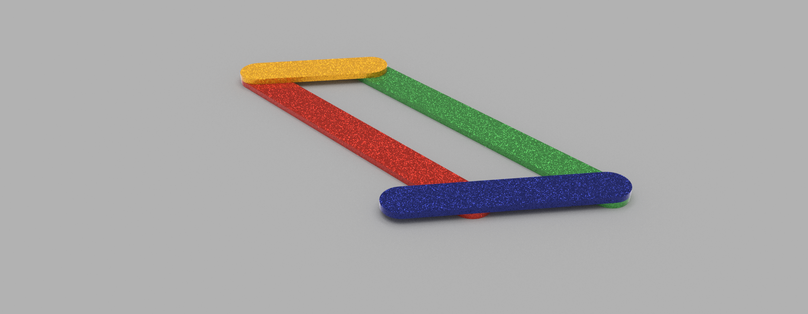
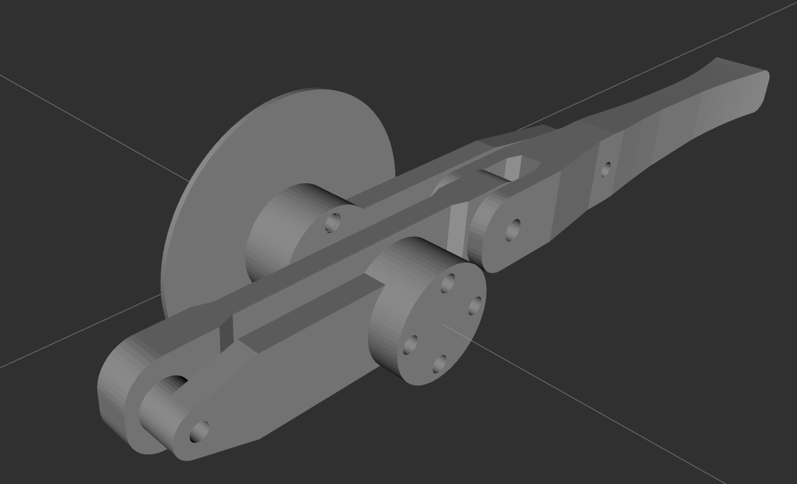
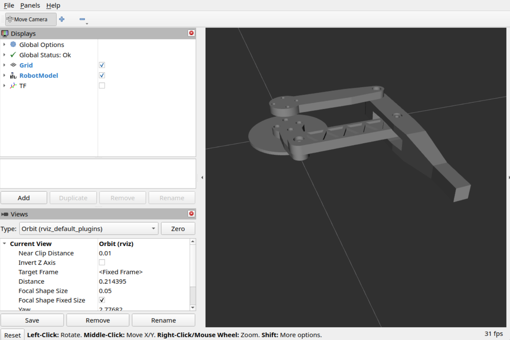

## Four Bar Tests

A ROS2 package for testing out a 4 bar linkage.







## Dependencies

Please install [urdf_launch](https://github.com/ros/urdf_launch) in the same workspace as four_bar_tests.

## Usage

Run ```ros2 launch four_bar_tests display.launch.xml```

## Fusion Export Tips
Export Fusion models to URDF using the [fusion2urdf](https://github.com/16cra40/fusion2urdf) tool.
* Make sure that the origin of the base link is coincident with the origin of the assembly - otherwise joint rotations will be incorrect.
* In ROS the z axis is positive so ensure that the model is oriented correctly before export.
### Before Export
* Make sure base_link is specified.
* Make sure base_link is ungrounded.
* Make sure all components are unlinked.

### After Export
* Use mimic joints to create the four bar kinematics.

## TODO
* ~~Convert LEG_ASSEMBLY1 to Mimic joints~~
* ~~Rotate LEG_ASSEMBLY1 to be flat~~
* ~~Convert from XACRO to URDF on launch~~
* ~~Independent launch from urdf_launch~~
* ~~Merge with main QRONK github~~
* Import into Gazebo
* ~~Test on ROS2 Jazzy~~
* ~~Modify the python script - package name~~